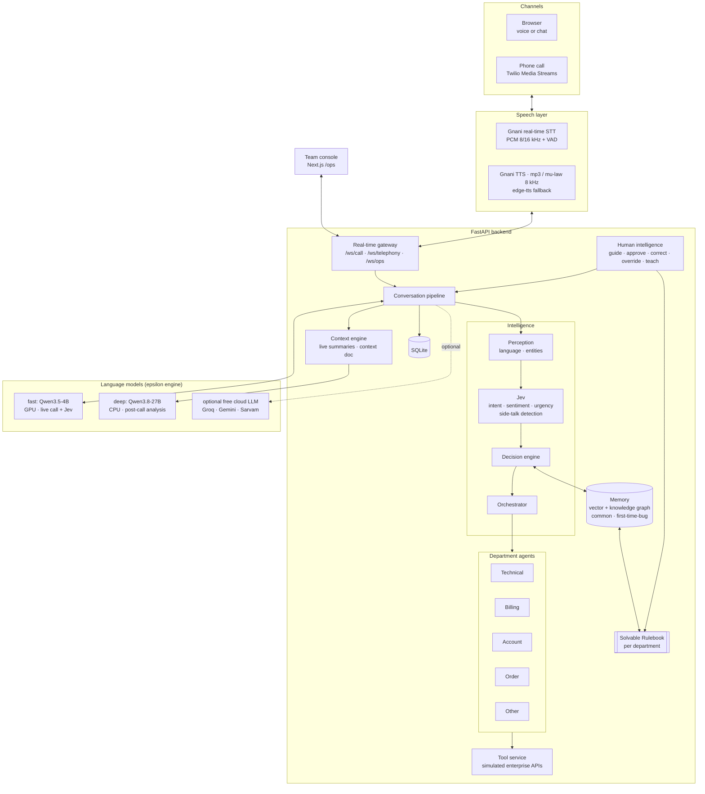
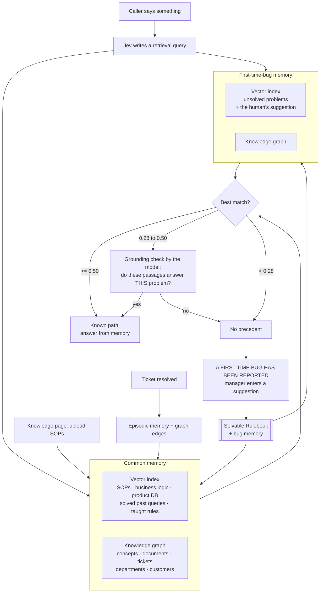
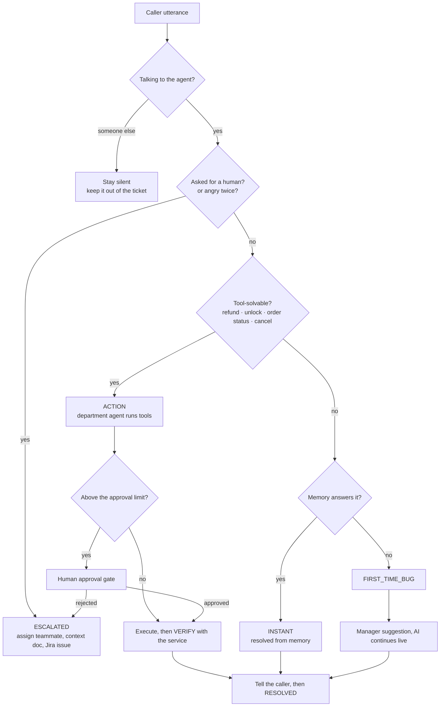
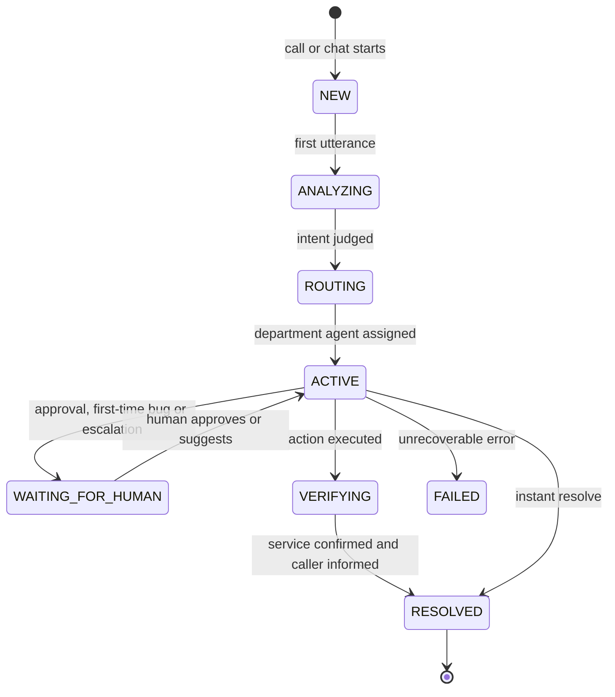
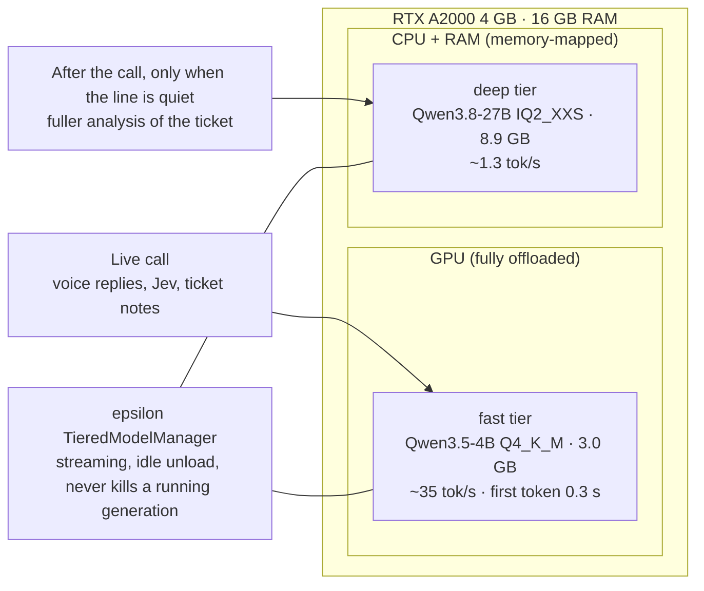
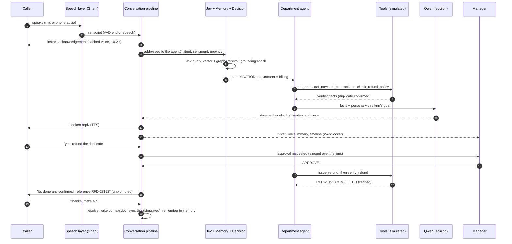
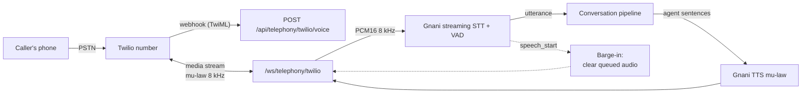

<div align="center">

# RESOLVYN

### AI-native customer support that *resolves* — by voice, by chat, by phone

Understand · Remember · Reason · Act · Verify · Learn — with humans embedded in the loop, not bolted on at the end.


</div>

---

## Contents

1. [What it is](#what-it-is)
2. [Architecture](#architecture)
3. [How a call works](#how-a-call-works)
4. [Quick start](#quick-start)
5. [Call it from a phone](#call-it-from-a-phone)
6. [Configuration](#configuration)
7. [Project structure](#project-structure)
8. [Testing](#testing)
9. [Measured performance](#measured-performance)
10. [Design principles](#design-principles)
11. [Honest limits](#honest-limits)
12. [Documentation](#documentation)

---

## What it is

Traditional support bots answer questions. Resolvyn **resolves issues**: it identifies the caller, checks the order and the payment records, detects the duplicate charge, checks policy, asks a human to approve the refund, executes it, **verifies** it with the refund service, and only then tells the customer it is done.

It has two sides that share one real-time backend:

| | Customer side (`/`) | Team console (`/ops`) |
|---|---|---|
| Who | The person calling or chatting | Support managers and agents |
| Sees | A live call/chat with **Riya**, their **ticket** and its status, a friendly timeline | Every ticket with an AI-written **one-line + detailed summary while the call is still going**, KPIs, reasoning, tools, knowledge used |
| Acts | Talks, interrupts, types, hangs up | **Guide · Approve · Correct · Override · Teach**, answers first-time bugs, ingests SOPs |

**Capabilities**

- **Talks like a person.** Female Indian-English/Hindi/Hinglish voice, natural fillers ("umm", "hmm, one sec"), sub-second acknowledgements, interruptible (barge-in), and it can tell when the caller is **talking to someone else** and stays quiet.
- **Right agent, right knowledge.** *Jev* (the fast judgment layer) scores intent, sentiment and urgency; the Orchestrator picks a department agent — **Technical, Billing, Account, Order, Other** — and each consults its own slice of the rulebook.
- **Memory it builds itself.** Ingest SOPs, business logic and product data (PDF / DOCX / MD / TXT / CSV / JSON). Every solved query becomes episodic memory in a **vector index + knowledge graph**.
- **First-time bugs.** No precedent in memory? The manager sees *"A FIRST TIME BUG HAS BEEN REPORTED — here's more detail, please enter your suggestion"*. The suggestion goes to the AI, which continues **the live call** with it, and into the Solvable Rulebook for next time.
- **Human approval gates** for risky actions, and real-time escalation *before the call ends* with a ticket, a context document and a Jira issue (simulated).
- **Runs locally.** Qwen through the author's **epsilon engine** on a 4 GB GPU; optional free cloud LLM for extra polish; deterministic fallback when no model is available.

---

## Architecture

### System overview



### Memory and the Solvable Rulebook

Two memories, each with a **vector half** and a **knowledge-graph half** — exactly as in the design diagrams. The rulebook is divided per department agent.



### Resolution paths



### Ticket lifecycle



### Model tiers on a 4 GB GPU (the epsilon engine)



> A dense 27B model cannot fit in 4 GB of VRAM, so it is not the live voice: at ~1.3 tokens/second a spoken sentence would take 10+ seconds. The engine loads it on demand for background analysis and returns its ~9 GB of RAM when done.

---

## How a call works



**Latency budget** — the caller never sits in silence: a pre-synthesised acknowledgement plays ~0.2 s after they stop talking while the real answer is prepared, the first sentence is spoken as soon as the model has produced it, background summaries are cancelled the instant the caller speaks again, and the model call for a judgment is only made when the fast rules are unsure.

---

## Quick start

**Requirements:** Windows 11, NVIDIA GPU (4 GB is enough), Python 3.11, Node 20+, Chrome or Edge for browser voice.

```powershell
# 1. Get the engine binaries and models (llama.cpp CUDA build + Qwen3.5-4B; add -Deep for the 27B)
cd engine
.\download_models.ps1 -Deep

# 2. Configure (optional): voices, cloud LLM, phone. Copy the template and edit.
cd ..\backend
copy .env.example .env

# 3. Start everything (first run creates the venv, installs packages, builds the UI)
cd ..
.\start.ps1
```

| | URL |
|---|---|
| Customer side | <http://localhost:3000> |
| Team console | <http://localhost:3000/ops> |
| API docs | <http://localhost:8000/docs> |

`.\stop.ps1` stops the API, the UI and the model servers and frees the GPU and RAM.

**Try it in 60 seconds:** open the team console, choose **Run demo → Duplicate payment**, and watch a scripted caller go through the real pipeline (mock enterprise APIs), including the approval gate. Choose **First-time bug** and untick the scripted operator to answer it yourself.

**Bring your own data:** *Knowledge → drop your SOPs*. Each section is routed to the right department agent and indexed into the memory. *Memory* shows the knowledge graph the AI builds.

---

## Call it from a phone

Yes — a real phone can call the agent. The bridge speaks the **Twilio Media Streams** protocol (8 kHz G.711 mu-law, 20 ms frames); **Gnani** provides the speech: streaming STT with voice-activity detection in, 8 kHz mu-law TTS out.



1. Put your Gnani key in `backend/.env` (`GNANI_API_KEY=`).
2. Expose the API: `ngrok http 8000` (or `cloudflared tunnel --url http://localhost:8000`) and set `PUBLIC_BASE_URL=https://<your-tunnel>` in `.env`.
3. In Twilio, point the number's **Voice webhook (HTTP POST)** at `https://<your-tunnel>/api/telephony/twilio/voice`. The team console → *Settings → Phone* shows the exact URL.
4. Call the number. The caller is recognised from the last four digits of their number (when it matches exactly one customer) and greeted by name; otherwise Riya asks who they are.

No Twilio account handy? `backend/scripts/sim_phone_call.py` simulates the whole call (Gnani-synthesised caller audio in, agent audio out, transcribed back) against the same endpoint. Other providers (Exotel, Plivo, Knowlarity) use the same streaming shape with different envelope names.

---

## Configuration

Everything is optional except the models. Settings live in `backend/.env` (never committed).

| Variable | Default | Purpose |
|---|---|---|
| `GNANI_API_KEY` | – | Enables Gnani STT + TTS (also required for phone calls) |
| `GNANI_VOICE` | `Nalini` | Agent voice. Audition with `scripts/voice_audition.py` |
| `TTS_PROVIDER` / `STT_PROVIDER` | `auto` | `auto` = Gnani when keyed, then edge-tts / the browser |
| `CLOUD_LLM_BASE_URL` `CLOUD_LLM_API_KEY` `CLOUD_LLM_MODEL` | – | Any OpenAI-compatible free tier (Groq, Gemini, OpenRouter, Sarvam) |
| `CLOUD_LLM_AUTH_HEADER` | `Authorization` | e.g. `api-subscription-key` for Sarvam |
| `LLM_PREFER` | `local` | `cloud` = cloud first, local fallback |
| `ENGINE_ENABLED` | `true` | `false` = run without local models (deterministic replies) |
| `PUBLIC_BASE_URL` | – | Public URL of the API for the phone webhook |
| `REFUND_AUTO_LIMIT` | `1000` | Refunds above this (INR) need a human Approve |

Engine and model layout: [`engine/README.md`](engine/README.md).

---

## Project structure

```text
resolvyn/
├── engine/                  epsilon engine copy: llama-server management, tiers, streaming, download script
├── backend/
│   ├── app/
│   │   ├── api/             REST routes, /ws/call, /ws/ops, /ws/telephony
│   │   ├── services/        conversation pipeline, ticket state, sessions, realtime hub, demo
│   │   ├── perception/      language + entity extraction from noisy speech
│   │   ├── judgment/        Jev: intent, sentiment, urgency, side-talk, grounding
│   │   ├── memory/          vector index, knowledge graph, ingestion, rulebook
│   │   ├── decision_engine/ instant | action | first-time bug | escalate
│   │   ├── agents/          Technical, Billing, Account, Order, Other + persona
│   │   ├── tools/           simulated enterprise APIs + tool service
│   │   ├── llm/             epsilon engine · cloud LLM · fallback
│   │   ├── voice/           Gnani STT/TTS, edge-tts, mu-law, spoken-text humaniser
│   │   ├── context_engine/  live case notes, context doc, deep analysis
│   │   ├── integrations/    Jira/Zoho sync (simulated)
│   │   └── human_intelligence/  guide · approve · correct · override · teach
│   ├── data/sops/           seed SOPs (ingested exactly like an upload)
│   ├── scripts/             engine smoke test, e2e caller, phone simulator, voice audition
│   └── tests/               24 tests: units + real WebSocket and telephony flows
├── frontend/                Next.js: customer side (/) and team console (/ops/*)
├── docs/                    architecture, context, engineering rules, source diagrams
├── start.ps1 · stop.ps1
```

---

## Testing

```powershell
cd backend
.venv\Scripts\python -m pytest -q                       # 24 tests, no GPU or network needed

# Play a caller over the real WebSocket against the running system
.venv\Scripts\python scripts\e2e_call.py --customer CUS-20481 --approve `
  "I was charged twice for the same order" "the order ID is ORD-83921" "yes please refund it"

# Simulate a phone call end to end (needs the Gnani key)
.venv\Scripts\python scripts\sim_phone_call.py --approve "Hi, I was charged twice" "The order ID is ORD 83921" "Yes refund it"
```

The suite runs the deterministic path (no model): refund with a human gate, side-talk, first-time bug → suggestion → the AI uses it → the next caller is answered from memory, escalation, API outage with retry, Demo Mode, phone bridge, audio codec, and the reply humaniser.

---

## Measured performance

Laptop with RTX A2000 (4 GB), i7-11850H, 16 GB RAM.

| Measure | Result |
|---|---|
| Local model load (fast tier) | ~8 s |
| Reply generation, Qwen3.5-4B | 35–39 tokens/s, first token 0.3–0.6 s |
| Instant acknowledgement after the caller stops | ~0.2 s (cached voice) |
| Text turn, first spoken sentence | 1.2–2.5 s |
| Phone: first agent audio after the caller stops | 0.9–1.2 s |
| Gnani TTS per request | 0.6–1.9 s |
| Deep tier, Qwen3.8-27B on CPU | ~1.3 tokens/s (background only) |
| Hero flow, resolved end to end (text) | ~40 s including the human approval |

---

## Design principles

- **The playbook decides, the model speaks.** Department agents run tools and return *verified facts*; the language model only phrases them. It is told never to invent amounts, limits or policies, and never to claim an action that a completed tool call has not verified.
- **Humans are in the loop, not the fallback.** Five actions — Guide, Approve, Correct, Override, Teach — every one writes an audit row, changes live state, and can extend the rulebook.
- **Never silent, never blocked.** Every model and voice provider has a fallback; a new caller utterance cancels background work; finalisation survives a hang-up.
- **Honest about simulation.** Enterprise APIs, Jira/Zoho and Confluence are simulated and labelled as such in the UI.
- **Privacy by construction.** The caller's view never shows confidence, internal summaries or tool payloads ("team side only").

---

## Honest limits

- The Customer, Order, Payment, Refund, Shipping and Account APIs, the Jira/Zoho sync and the Confluence document are **simulations**.
- "Learning" means **recorded learning events and rulebook updates**; no model is retrained.
- The vector half of the memory is sparse TF-IDF (deliberate: the GPU belongs to the language model); it is a small class that can be swapped for dense embeddings.
- A 4B model on-device is good but not a 70B: for the most natural phrasing, plug in a free cloud LLM (`CLOUD_LLM_*`).
- Gnani trial keys are rate-limited (a burst of ~3 requests, refilling in ~2 s). Resolvyn spaces requests, merges a reply into at most two TTS calls, and caches stock phrases on disk; a production key removes the constraint.
- Voice quality is subjective and cannot be judged from logs: run `scripts/voice_audition.py` and pick the voice you like.

---

## Documentation

| | |
|---|---|
| [`docs/context.md`](docs/context.md) | What Resolvyn is, glossary, project stage |
| [`docs/architecture.md`](docs/architecture.md) | System design from the source diagrams, plus §4 *As built* |
| [`docs/claude.md`](docs/claude.md) | Engineering rules and vocabulary for working in this repo |
| [`docs/project.md`](docs/project.md) | Prototype UI and demo specification |
| [`engine/README.md`](engine/README.md) | The epsilon engine, model tiers, setup |

<div align="center"><sub>Built with intent. Designed to resolve.</sub></div>
