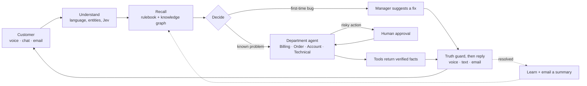

<div align="center">


### The AI support team that resolves issues, not just answers questions

Talk to it, chat with it, or email it. It checks the order, fixes the problem, proves it worked, and brings in a human exactly when one is needed.


</div>

---

## What Resolvyn is

Most support bots read you a help article. Resolvyn **does the work**. A customer says *"I was charged twice for my earbuds."* Resolvyn identifies them, finds the order, spots the duplicate charge made 38 seconds after the first, checks the refund policy, asks a manager to approve the ₹2,499 refund, executes it, **verifies it with the refund service**, and only then tells the customer it is done, by voice, chat or email, followed by a written summary.

Every step is visible to the team in real time, every risky action has a human gate, and every problem the AI has never seen before goes to a person who teaches it, so the next customer gets the answer instantly.

It runs on a laptop. The live conversation uses a 4-billion-parameter Qwen model fully on a 4 GB GPU, so customer data never leaves the machine unless you choose a cloud model.

---

## What makes it different

| | |
|---|---|
| **It resolves, and proves it** | Agents run real tools (orders, payments, refunds, account unlock) and the reply can only contain facts those tools returned. "Your refund is done" is said only after the refund service confirms it. |
| **A truth guard between the model and the customer** | Language models invent things. Resolvyn filters every sentence before it is spoken: unverified claims ("already reported by other customers") and made-up dates are blocked and counted on the console. |
| **Sounds like a person** | An acknowledgement ("hmm, one sec") plays about 10 ms after you stop talking, before any model has run. Replies stream sentence by sentence, you can interrupt, and Riya notices when you are talking to someone else and stays quiet. |
| **Jev, the fast judgment layer** | Intent, sentiment, urgency, "is this for me?", yes/no/done and "I want a human" are decided by rules in about 13 ms, on every sentence, so the model is only used where it adds value. |
| **Live AI brain** | Every turn, on screen: what was heard, how it was judged, what was recalled, the decision, the tools that ran, what the guard blocked, and what was said, with timings. Judges can watch the AI think. |
| **First-time bugs teach the system** | Nothing in memory? The manager sees a banner, types a suggestion, and Riya relays it **on the live call**. It is stored in the Solvable Rulebook, and the next caller with the same problem is answered from memory without a human. |
| **Human intelligence, not human fallback** | Guide, Approve, Correct, Override and Teach are first-class actions on every ticket. Refunds over ₹1,000 wait for approval. Escalation happens **before** the call ends, with a context document and a Jira issue (simulated). |
| **One brain, every channel** | Voice call, chat and email use the same pipeline, memory and tools. Email threads stay on one ticket, and after every call or chat the customer gets a written summary with the verified details. |
| **A brain you can feed** | Drop in SOPs, policies and product sheets (PDF, DOCX, MD, CSV, JSON). They are split by department, indexed, and linked in a knowledge graph. Import your own orders, payments, shipments and customers from CSV. |
| **Hindi, Hinglish and English** | Speech in and out through Gnani (Indian-English and Hindi voices). Hinglish typed in English letters is answered in the same style, and the conversation stays in the language you chose. |
| **Private by default** | Local Qwen models through a tiered engine, with an optional free cloud model for extra polish and a deterministic fallback when no model is running at all. |

---

## How it works



1. **Understand.** Speech becomes text (Gnani), language and details (order IDs, emails) are extracted, and Jev judges intent, sentiment and who the caller is talking to.
2. **Recall.** A vector index and a knowledge graph return the policies, past solved cases and team rules that apply, from the department's own slice of the rulebook.
3. **Decide.** Known problem, first-time bug, action with tools, or escalate to a person.
4. **Act and verify.** The department agent runs its tools. Nothing is claimed until a tool call has verified it.
5. **Speak.** The model phrases the verified facts like a person; the truth guard removes anything unverified.
6. **Learn.** The ticket, the fix and the human's guidance become memory. The customer gets an email summary.

---

## Features

**For the customer**
- Talk to **Riya** with an on-screen voice assistant (an animated orb that reacts to listening, thinking and speaking), chat, or send an email.
- A **live ticket** with a five-step progress view and a plain-language timeline, plus their ticket history.
- Refund approvals shown honestly as "waiting for approval", never as done.
- A **summary email** after every call or chat: what they asked, what was done (with refund references), status, ticket number.

**For the support team**
- **Overview** with KPIs, live tickets, the Live AI brain, approvals and first-time-bug alerts on one screen.
- **Ticket workspace:** one-line and detailed AI summary written while the call is still going, conversation, tools, knowledge used, the human-action panel, full timeline, context document.
- **Agents, Customers (with editable email), Emails (every message Riya sent, with an HTML preview), Activity, Analytics, Learning signals, Human intelligence.**
- **Knowledge:** ingest documents, test what the AI would retrieve for any sentence, see the rulebook by department. **Business data:** orders, payments, shipments and customers in a real database, importable from CSV or JSON, with a lookup tester. **Memory:** the knowledge graph, explorable.
- **Demo mode:** a scripted caller runs through the real pipeline, with or without a scripted manager.

**Under the hood**
- Five department agents (Technical, Billing, Account, Order, Other), each with playbooks and tools; the orchestrator hands the caller between them without anyone repeating themselves.
- Forgiving lookups: `ORD-83921`, `83921`, "O R D 8 3 9 2 1" or just the last digits all find the order, and a known caller doesn't need to read out an ID at all.
- Natural conversation handling: mid-sentence pauses are merged, questions during a pending approval are answered without losing it, "are you a bot?" gets an honest answer, and angry callers are escalated after two exchanges.
- A LangGraph orchestration layer (`agents/`) for the ticket workflow, with checkpoints and human interrupts.
- An optional real phone bridge (Twilio Media Streams, 8 kHz mu-law), tested against a simulated stream.

---

## Quick start

**Requirements:** Windows 11, an NVIDIA GPU (4 GB is enough), Python 3.11, Node 20+, Chrome or Edge.

```powershell
cd engine ; .\download_models.ps1 -Deep      # llama.cpp CUDA build + Qwen3.5-4B (and the 27B for background analysis)
cd ..\backend ; copy .env.example .env       # optional: voice, cloud model, email
cd .. ; .\start.ps1                          # first run creates the venv and builds the UI
```

| | |
|---|---|
| Customer side | <http://localhost:3000> |
| Team console | <http://localhost:3000/ops> |
| API docs | <http://localhost:8000/docs> |

`.\start.ps1 -Tunnel` prints a public HTTPS address so a phone or a judge's laptop can open the customer side. `.\stop.ps1` stops everything and frees the GPU.

**Try it in 60 seconds:** open the console, choose **Run demo → Duplicate payment**, and watch the whole flow including the approval gate. Then open the customer side, choose **Lovekesh Anand**, and talk.

### The demo customers

| Customer | Story |
|---|---|
| **Lovekesh Anand** (Premium) | Charged twice for *Wireless Earbuds Pro* (₹2,499, 38 seconds apart), a *Laptop Stand* delayed at the Nagpur hub, and *Studio Headphones* that show an error the AI has never seen (a first-time bug). |
| **Dua Saeed** (Standard) | Account **locked** after five failed logins, a *Yoga Mat Pro* still processing (cancellable), and a delivered *Smart Kettle*. |

The full script, the orders and what to say: [`docs/demo-runbook.md`](docs/demo-runbook.md) and [`docs/test-data.md`](docs/test-data.md).

### Email

Works immediately with a built-in simulated inbox (Team console → **Emails**). For real email you need a **Gmail address, a Google App Password** (turn on 2-step verification, then Google Account → Security → App passwords), and the customers' real addresses:

```
EMAIL_ADDRESS=you@gmail.com
EMAIL_PASSWORD=<app password>
EMAIL_SMTP_HOST=smtp.gmail.com
EMAIL_IMAP_HOST=imap.gmail.com
EMAIL_REDIRECT_TO=you@gmail.com      # while testing: every email lands in your inbox
```

Set each customer's address in **Customers**. Riya then emails summaries and replies, and answers customers who write to the support address.

### Configuration

Everything is optional except the models. Settings live in `backend/.env` (never committed).

| Variable | Purpose |
|---|---|
| `GNANI_API_KEY`, `GNANI_VOICE` | Speech-to-text and text-to-speech (falls back to edge-tts and the browser) |
| `CLOUD_LLM_BASE_URL/API_KEY/MODEL`, `LLM_PREFER` | Optional free cloud model (Groq, Gemini, OpenRouter...); `cloud` = cloud first, local fallback |
| `ENGINE_ENABLED` | `false` = run without local models (deterministic replies) |
| `EMAIL_*` | Real mailbox, redirect and summaries (above) |
| `REFUND_AUTO_LIMIT` | Refunds above this (INR, default 1000) need a human Approve |
| `PUBLIC_BASE_URL`, `TWILIO_*`, `PHONE_ALIASES` | Optional phone bridge |

---

## Under the hood

- **Models:** Qwen3.5-4B (Q4_K_M) on the GPU for the live conversation and Jev; Qwen3.8-27B (IQ2_XXS) on CPU and RAM for deep analysis after a call, only when the line is quiet. Both run through the epsilon tiered engine (llama.cpp CUDA).
- **Memory:** a sparse vector index (TF-IDF, so the GPU stays free for the language model) plus a knowledge graph in SQLite, in two stores (common and first-time-bug).
- **Backend:** FastAPI, SQLModel/SQLite, WebSockets. **Frontend:** Next.js 14, Tailwind and shadcn/ui, light and dark themes.
- **Speech:** Gnani streaming STT with voice-activity detection, and TTS with a disk cache and rate-limit handling.

### Measured (RTX A2000 4 GB, i7-11850H, 16 GB RAM)

| Measure | Result |
|---|---|
| Acknowledgement after the caller stops | ~10 ms (rules and a cached phrase, no model) |
| Jev judgment | ~13 ms per sentence |
| Local reply, first spoken sentence | 1.2 to 2.5 s (Qwen3.5-4B at 35 to 39 tokens/s) |
| Hero flow, resolved end to end | ~40 s including the human approval |
| Automated tests | 103 backend, 19 orchestration, all passing without a GPU |

---

## Project structure

```
backend/     FastAPI app: perception, Jev, decision engine, agents, tools, memory, voice, email, API
frontend/    Next.js app: customer side (/) and team console (/ops), shadcn/ui components
agents/      LangGraph ticket orchestration with checkpoints and human interrupts
engine/      The epsilon engine: tiered llama.cpp model manager
docs/        Demo runbook, test data, architecture
```

```powershell
cd backend ; .venv\Scripts\python -m pytest -q     # 103 tests, no GPU or API keys needed
```

## Honest limits

- The customer, order, payment, refund and shipping APIs, and the Jira and Confluence syncs, are **simulations**; replace `backend/app/tools/mock_apis.py` to connect real systems.
- "Learning" means recorded learning events and rulebook updates; no model is retrained.
- A 4B model on a laptop is good, not perfect: for the most natural phrasing plug in a free cloud model with `CLOUD_LLM_*`.
- A real phone number needs a paid Twilio account; the phone bridge is tested against a simulated stream, and the browser call (also on a phone, over the tunnel) is the supported live path.
- Gnani trial keys are rate limited; Resolvyn spaces requests, caches stock phrases, and falls back to another voice.
