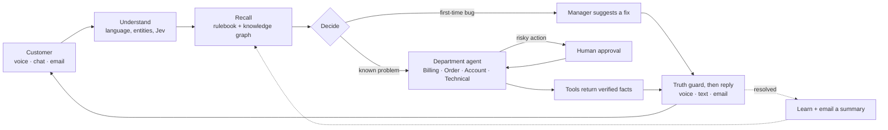

<div align="center">


<br/>

# Resolvyn

### The AI support team that resolves issues, not just answers questions.

> Talk to it · Chat with it · Email it.
> It finds the order, fixes the problem, proves it worked, and brings in a human exactly when one is needed.

<br/>


</div>

---

## What Resolvyn Is

Most support bots read you a help article. **Resolvyn does the work.**

A customer says *"I was charged twice for my earbuds."* Resolvyn identifies them, finds the order, spots the duplicate charge made 38 seconds after the first, checks the refund policy, asks a manager to approve the ₹2,499 refund, **executes it**, verifies it with the refund service, and only then tells the customer it is done — by voice, chat, or email — followed by a written summary.

Every step is visible to the team in real time. Every risky action has a human gate. Every problem the AI has never seen goes to a person who teaches it, so the **next customer gets the answer instantly from memory**.

It runs on a laptop. The live conversation uses a 4-billion-parameter Qwen model fully on a **4 GB GPU** — customer data never leaves the machine unless you choose a cloud model.

---

## The Selling Points

### It Resolves — and Proves It

> Other support bots say "done." Resolvyn is only allowed to say "done" after the tool confirms it.

Agents run real tools (orders, payments, refunds, account unlock). The reply pipeline blocks any claim not backed by a tool response. "Your refund is processed" is spoken only after the refund service returns a confirmation reference.

---

### A Truth Guard Between the Model and the Customer

> Language models hallucinate. Resolvyn filters every sentence before it reaches the customer.

Unverified claims ("already reported by other customers"), made-up dates, and invented reference numbers are detected and removed before the voice or text reply is sent. Blocked sentences are counted and visible on the team console in real time.

---

### Sounds Like a Person — Feels Like a Person

> Acknowledgement plays ~10 ms after you stop talking, before any model has even started.

- An *"hmm, one sec"* plays immediately on silence — no awkward dead air.
- Replies stream sentence by sentence; you can interrupt mid-sentence.
- Riya detects when you are talking to someone else in the room and stays quiet.
- Hinglish, Hindi, and English — all in the same call, in the voice of your choice (Gnani Indian voices).

---

### Jev — The 13 ms Judgment Layer

> Intent, sentiment, urgency, "is this for me?", yes/no/done, and "I want a human" — decided in ~13 ms, on every sentence.

Jev (Judgment Engine) runs fast rule-based classification before the language model. The model is only used where it genuinely adds value, keeping the conversation responsive even on modest hardware.

---

### Live AI Brain — Transparent and Watchable

> Every turn, on screen: what was heard, how it was judged, what was recalled, the decision, the tools that ran, what the guard blocked, and what was said — with timings.

The team console is designed so a manager or reviewer can watch the AI reason through a problem in real time. Nothing happens in a black box.

---

### First-Time Bugs Teach the System

> The AI has never seen this problem? A manager sees a banner, types a fix, and Riya relays it on the live call.

The fix is stored in the **Solvable Rulebook**. The next caller with the same problem is answered from memory without a human. The system becomes more capable with every edge case encountered.

---

### Human Intelligence, Not Human Fallback

> Guide · Approve · Correct · Override · Teach — all first-class actions on every ticket.

- Refunds above ₹1,000 wait for an explicit human **Approve** before executing.
- Escalation happens **before** the call ends, with a full context document and a Jira issue.
- Humans see the AI's reasoning and can correct it, not just override it.

---

### One Brain, Every Channel

> Voice, chat, and email share the same pipeline, memory, and tools.

- Email threads stay on one ticket.
- After every call or chat, the customer automatically receives a **written summary email** with verified details (refund reference, order status, next steps).
- Context follows the customer across channels without repetition.

---

### A Brain You Can Feed

> Drop in SOPs, policies, and product sheets. Import your own orders and customers from CSV.

PDFs, DOCX, Markdown, CSV, JSON — all split by department, indexed in a vector store, and linked in a knowledge graph. Test what the AI would retrieve for any sentence directly from the team console.

---

### Private by Default

> Runs entirely on-device. Customer data never leaves the machine unless you explicitly choose a cloud model.

Tiered model engine: Qwen3.5-4B on the GPU for live calls, Qwen3.8-27B on CPU/RAM for deep post-call analysis. An optional free cloud model (Groq, Gemini, OpenRouter) can be layered on for additional capability.

---

## How It Works



1. **Understand.** Speech becomes text (Gnani), language and entities (order IDs, emails) are extracted, and Jev judges intent, sentiment, and who the caller is addressing.
2. **Recall.** A vector index and knowledge graph return the policies, past solved cases, and team rules from the department's own rulebook slice.
3. **Decide.** Known problem, first-time bug, tool action, or escalate to a person.
4. **Act and verify.** The department agent runs its tools. Nothing is claimed until a tool has confirmed it.
5. **Speak.** The model phrases verified facts; the truth guard removes anything unverified.
6. **Learn.** The ticket, the fix, and human guidance become memory. The customer receives an email summary.

---

## Performance (RTX A2000 4 GB · i7-11850H · 16 GB RAM)

| Measure | Result |
|---|---|
| Acknowledgement after caller stops | ~10 ms (rules + cached phrase, no model) |
| Jev judgment | ~13 ms per sentence |
| Local reply — first spoken sentence | 1.2 – 2.5 s (Qwen3.5-4B at 35–39 tok/s) |
| Hero flow resolved end-to-end | ~40 s including human approval |
| Automated test suite | 103 backend + 19 orchestration, all passing without GPU |

---

## Feature Map

**For the customer**
- Talk to **Riya** via an animated voice orb that reacts to listening, thinking, and speaking states, or interact via chat or email.
- A live ticket with a five-step progress view and a plain-language timeline.
- Refund approvals shown honestly as *"waiting for approval"* — never marked done before confirmation.
- A summary email after every call or chat: what was asked, what was done (with references), and the ticket number.

**For the support team**
- **Overview** — KPIs, live tickets, Live AI Brain, approvals, and first-time-bug alerts on one screen.
- **Ticket workspace** — one-line and detailed AI summary written mid-call, conversation log, tools used, knowledge referenced, human-action panel, full timeline, and context document.
- **Emails** — every message Riya sent, with HTML preview.
- **Knowledge** — ingest documents, test retrieval for any sentence, and view the rulebook by department.
- **Business data** — orders, payments, shipments, and customers in a real SQLite database; importable from CSV or JSON with a lookup tester.
- **Memory** — the knowledge graph, explorable.
- **Demo mode** — a scripted caller runs the real pipeline with or without a scripted manager.

**Under the hood**
- Five department agents (Technical, Billing, Account, Order, Other) with playbooks and tools; the orchestrator hands callers between departments without anyone repeating themselves.
- Forgiving lookups: `ORD-83921`, `83921`, "O R D 8 3 9 2 1", or just the last digits all resolve to the same order.
- Natural conversation handling: mid-sentence pauses are merged, questions during a pending approval are answered without losing it, "are you a bot?" receives an honest answer, and angry callers are escalated after two exchanges.
- LangGraph orchestration (`agents/`) with checkpoints and human interrupts.
- Optional real phone bridge (Twilio Media Streams, 8 kHz mu-law).

---

## Quick Start

**Requirements:** Windows 11 · NVIDIA GPU (4 GB minimum) · Python 3.11 · Node 20+ · Chrome or Edge

```powershell
cd engine ; .\download_models.ps1 -Deep      # llama.cpp CUDA build + Qwen3.5-4B (and 27B for background analysis)
cd ..\backend ; copy .env.example .env       # optional: voice, cloud model, email
cd .. ; .\start.ps1                          # first run creates the venv and builds the UI
```

| | URL |
|---|---|
| Customer side | http://localhost:3000 |
| Team console | http://localhost:3000/ops |
| API docs | http://localhost:8000/docs |

`.\start.ps1 -Tunnel` prints a public HTTPS address so a phone or a reviewer's laptop can open the customer side.  
`.\stop.ps1` stops everything and frees the GPU.

**Try it in 60 seconds:** open the console, choose **Run demo → Duplicate payment**, and watch the full flow including the approval gate. Then open the customer side, select **Lovekesh Anand**, and talk.

### Demo Customers

| Customer | Story |
|---|---|
| **Lovekesh Anand** (Premium) | Charged twice for *Wireless Earbuds Pro* (₹2,499, 38 s apart) · *Laptop Stand* delayed at the Nagpur hub · *Studio Headphones* showing an error the AI has never seen (first-time bug). |
| **Dua Saeed** (Standard) | Account locked after five failed logins · *Yoga Mat Pro* still processing (cancellable) · a delivered *Smart Kettle*. |

Full script, orders, and prompts: [`docs/demo-runbook.md`](docs/demo-runbook.md) and [`docs/test-data.md`](docs/test-data.md).

### Email Setup

Works immediately with a built-in simulated inbox (Team console → **Emails**). For real email:

```
EMAIL_ADDRESS=you@gmail.com
EMAIL_PASSWORD=<google app password>
EMAIL_SMTP_HOST=smtp.gmail.com
EMAIL_IMAP_HOST=imap.gmail.com
EMAIL_REDIRECT_TO=you@gmail.com      # while testing: every email lands in your inbox
```

Set each customer's address in **Customers**. Riya then sends summaries and replies to incoming messages.

### Configuration

Everything is optional except the models. Settings live in `backend/.env` (never committed).

| Variable | Purpose |
|---|---|
| `GNANI_API_KEY`, `GNANI_VOICE` | Streaming STT + TTS (falls back to edge-tts and the browser) |
| `CLOUD_LLM_BASE_URL/API_KEY/MODEL`, `LLM_PREFER` | Optional free cloud model; `cloud` = cloud first, local fallback |
| `ENGINE_ENABLED` | `false` = run without local models (deterministic replies) |
| `EMAIL_*` | Real mailbox, redirect, and summaries |
| `REFUND_AUTO_LIMIT` | Refunds above this amount (INR, default 1000) require human Approve |
| `PUBLIC_BASE_URL`, `TWILIO_*`, `PHONE_ALIASES` | Optional phone bridge |

---

## Project Structure

```
backend/     FastAPI app: perception, Jev, decision engine, agents, tools, memory, voice, email, API
frontend/    Next.js 14: customer side (/) and team console (/ops), shadcn/ui components
agents/      LangGraph ticket orchestration with checkpoints and human interrupts
engine/      The epsilon engine: tiered llama.cpp model manager
docs/        Demo runbook, test data, architecture notes
```

```powershell
cd backend ; .venv\Scripts\python -m pytest -q     # 103 tests, no GPU or API keys needed
```

---

## Honest Limits

- Customer, order, payment, refund, and shipping APIs, as well as Jira and Confluence syncs, are **simulations**. Replace `backend/app/tools/mock_apis.py` to connect real systems.
- "Learning" means recorded events and rulebook updates — no model retraining occurs.
- A 4B model on a laptop is capable, not perfect. Use `CLOUD_LLM_*` to layer in a free cloud model for more natural phrasing.
- A real phone number requires a paid Twilio account; the browser call over the tunnel is the supported live path.
- Gnani trial keys are rate-limited; Resolvyn spaces requests, caches common phrases, and falls back to another voice automatically.

---

<div align="center">
  <sub>Built with intent. Designed to resolve.</sub>
</div>
